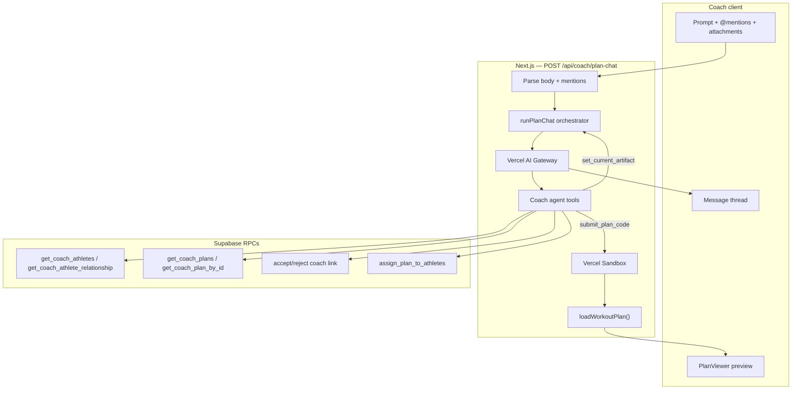

# Inline tools — coach agent expansion

Expand the coach prompt workspace from a plan-codegen specialist into a **generalized coach agent** with database tools, functional `@` mentions, artifact-gated split layout, and edit-mode drop-in from chat.

**Surface:** Coach only (`/coach`, `/coach/plans/[planId]/edit`). No athlete agent.

## Locked decisions

| Topic | Choice |
| --- | --- |
| Agent scope | Coach home + edit workspace; general coaching assistant with plan tools |
| Intent routing | **No classifier** — single agent, general system prompt + tool descriptions |
| Codegen guide | **`get_plan_codegen_guide` tool** — not in system prompt; agent must call before `submit_plan_code` |
| System prompt | High-level “what to call when”; detailed behavior lives in tool descriptions |
| Tool step budget | `PLAN_CHAT_MAX_TOOL_STEPS = 50` (was 12) |
| Plan JSON in tools | **Never return full `plan_data` blob** — summaries/metadata only |
| Artifact boundary | `currentArtifact` set only for plan create/edit flows — `get_plan` / `assign_plan` do **not** set preview |
| Edit drop-in | `set_current_artifact` tool loads a saved plan into preview + edit semantics from chat |
| Read tools | List + read athletes, plans, pending invites, plan versions (metadata) |
| Mutating tools | Accept/reject link requests; assign/reassign plans to athletes |
| Delete tools | **Out of scope** until confirmation UX exists |
| `@` mentions | Send `{ kind, id }[]` per message; **lazy** resolution via tools (IDs may suffice) |
| Mention payload | `kind` + `id` only — no eager hydration in system prompt |
| Split layout | Show split pane **only when `currentArtifact` is set**; chat stays centered until then |
| Layout transition | When artifact appears, chat column **shifts right** to make room for preview |
| Save (create) | After first save, **redirect** to `/coach/plans/[planId]/edit` and **retain conversation** |
| Save (edit) | Unchanged — stay on page, back link, unsaved guard |

## Data boundaries (unchanged)

| Data | LLM (Gateway) | Sandbox |
| --- | --- | --- |
| User prompt + thread | Yes | No |
| `@` mention `{kind, id}` | Yes (metadata only) | No |
| Normalized upload text | Yes (via `read_session_file`) | No |
| `summarizePlan(currentArtifact)` | Yes (when artifact active) | No |
| `forge_plan` cheat sheet | Yes (**via `get_plan_codegen_guide` tool only**) | No (library in VM) |
| Full `currentArtifact` JSON | **No** | Yes → `current_plan.json` |
| Full saved plan JSON from DB | **No** (tools return summaries) | No |
| Generated Python | No | Yes → `run.py` |

## Phases

Build in order. Each phase doc uses checkboxes for iterative progress.

1. [phase_1.md](./phase_1.md) — Agent foundation (general prompt, codegen guide tool, step budget)
2. [phase_2.md](./phase_2.md) — Read tools (athletes, plans, invites — no blobs)
3. [phase_3.md](./phase_3.md) — Mutating tools (link accept/reject, plan assign/reassign)
4. [phase_4.md](./phase_4.md) — `set_current_artifact` + edit-mode drop-in from chat
5. [phase_5.md](./phase_5.md) — `@` mentions (`{kind, id}` payload, lazy resolution)
6. [phase_6.md](./phase_6.md) — Workspace UI (artifact-gated split, chat shift)
7. [phase_7.md](./phase_7.md) — Save redirect with conversation retention
8. [phase_8.md](./phase_8.md) — Integration tests & QA

## Architecture

## Tool catalog (target)

| Tool | Type | Notes |
| --- | --- | --- |
| `list_session_files` | Read | Existing — session uploads |
| `read_session_file` | Read | Existing — session uploads |
| `get_plan_codegen_guide` | Read | **New** — `forge_plan` cheat sheet + Python rules |
| `list_athletes` | Read | Paginated/search; no PII beyond list row |
| `get_athlete` | Read | Relationship + current assignment metadata |
| `list_plans` | Read | Paginated/search |
| `get_plan` | Read | Metadata + `summarizePlan()` — **no full blob** |
| `list_plan_versions` | Read | Version history metadata |
| `list_pending_invites` | Read | Pending link requests |
| `accept_coach_link` | Mutate | Accept pending athlete link |
| `reject_coach_link` | Mutate | Reject pending athlete link |
| `assign_plan` | Mutate | Assign/reassign plan to athlete(s) |
| `set_current_artifact` | Workspace | Load saved plan into preview; enables edit/split UI |
| `submit_plan_code` | Artifact | Existing — queue Python for sandbox |

## Related docs

- [plan-generation overview](../plan-generation/overview.md) — v1 sandbox pipeline
- [plan-persistence](../plan-persistence/README.md) — save/edit routes
- [linking](../linking/) — coach–athlete link lifecycle
