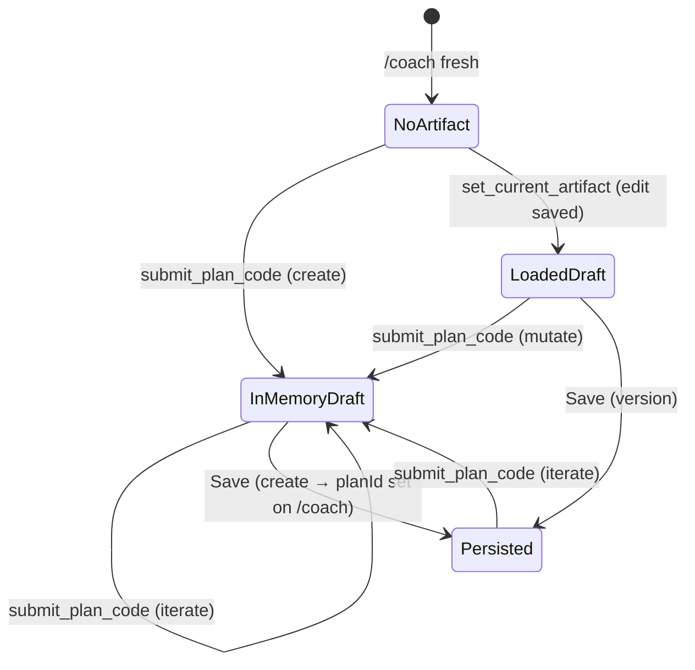

# Phase 4 — `set_current_artifact` + edit drop-in

**Status:** Not started

**Goal:** Let the agent load a saved plan into the workspace preview from chat, enabling split-pane edit without navigating away manually. Only this tool (and `submit_plan_code` success) sets `currentArtifact`.

**Depends on:** [phase_2.md](./phase_2.md) (`get_plan` loads full plan server-side for artifact)

**Blocks:** Phase 6 (split UI needs artifact), Phase 7 (post-create `planId` semantics)

---

## When to use `set_current_artifact`

Call only when the user wants to **open a saved plan for editing** and that plan is **not already** the active in-preview artifact. Examples:

- “Edit Summer Block”
- “Add a week to this plan” (referring to a saved plan)
- “Open Jane's current plan and change the deload week”

Do **not** call for:

- Fresh plan creation (use `submit_plan_code` from empty seed)
- Iterating the plan already in preview (use `summarize_current_artifact` + `submit_plan_code`)
- Reading plan metadata only (use `get_plan`)
- Assigning a plan to an athlete (use `assign_plan`)

---

## Create vs update — how it works

### A. Plan creation (no saved plan yet)

```
/coach → no artifact, no planId
User: "Build me a 4-week hypertrophy block"
```

1. Agent calls `get_plan_codegen_guide`, then `submit_plan_code`.
2. Sandbox seeds from `currentArtifact: null` → empty `current_plan.json`.
3. Validated output → `artifact` SSE event → preview appears, split pane opens.
4. `planId` remains null until Save.

**`set_current_artifact` is not used.**

### B. Edit a saved plan (not yet in preview)

```
/coach → no artifact (general chat)
User: "Edit Summer Block and add a deload week"
```

1. Agent may call `list_plans({ q: "Summer Block" })` or `get_plan` to resolve `planId`.
2. Agent calls **`set_current_artifact(planId)`**:
   - Server loads full `plan_data` (server-only).
   - Client receives `setArtifact` event → preview + `planId` in workspace state.
   - Split pane opens.
   - Tool returns `{ ok, planId, name, summary }` to LLM — no blob.
3. Agent calls `summarize_current_artifact` if needed, then `get_plan_codegen_guide` → `submit_plan_code`.
4. Sandbox seeds from loaded `currentArtifact` → mutates existing structure.
5. New `artifact` event updates preview.
6. Save → version API (because `planId` is set).

### C. Iterate plan already in preview

```
/coach or /coach/plans/[id]/edit → artifact active
User: "Add a week"
```

1. Agent calls `summarize_current_artifact` (optional), `get_plan_codegen_guide` → `submit_plan_code`.
2. Sandbox seeds from current `currentArtifact`.

**`set_current_artifact` is not needed** unless switching to a **different** saved plan.

### D. After first save on `/coach` (Phase 7)

```
/coach → artifact in preview, planId set internally after Save
User: "Add another week"
```

Same as (C). Save uses version API. No redirect, no reload.

### State diagram



**Only two things set the preview artifact:** `submit_plan_code` success, or `set_current_artifact`.

### Edge case — draft replacement

If the user has an **unsaved in-memory draft** and asks to edit a different saved plan, `set_current_artifact` replaces the preview. Agent should confirm in chat when the intent is ambiguous (“You have an unsaved draft — open Summer Block instead?”).

---

## Scope

### `set_current_artifact` tool

- [ ] Input: `planId: string`
- [ ] Server loads plan via `getCoachPlanById` (full `plan_data` — **server only**, not returned to LLM)
- [ ] Tool return to LLM: `{ ok: true, planId, name, summary: summarizePlan(plan) }` — no blob
- [ ] Side effect: emit workspace event to client with full validated `WorkoutPlan`

### SSE / client event

- [ ] New SSE event type: `setArtifact` (or reuse `artifact` with `source: "loaded"`)
  - Payload: `{ plan: WorkoutPlan, planId: string, title: string }`
- [ ] Client `applyChatEvent` handles event → sets `currentArtifact`, `artifactTitle`, `planId`
- [ ] Triggers split-pane layout (Phase 6) when artifact arrives

### Workspace semantics after load

- [ ] `planId` tracked in workspace state
- [ ] Save uses version API (`saveCoachPlanVersion`) not create
- [ ] Back link to `/coach/plans/[planId]` available (on `/coach` after Phase 7)
- [ ] `get_plan` and `assign_plan` do **not** set artifact

### Orchestrator

- [ ] `set_current_artifact` execute callback invokes `input.emit({ type: 'setArtifact', ... })`
- [ ] Does not interrupt current turn streaming

### Tests

- [ ] Tool unit test: loads plan, returns summary only
- [ ] Integration test: SSE event emitted with validated plan
- [ ] Client reducer test: `setArtifact` updates state correctly

---

## Files

| File | Action |
| --- | --- |
| `forge-next/lib/ai/coach-agent/tools/artifact-tools.ts` | New |
| `forge-next/lib/ai/plan-chat/types.ts` | Extend SSE event types |
| `forge-next/lib/ai/plan-chat/events.ts` | Encode new event |
| `forge-next/lib/ai/plan-chat/orchestrator.ts` | Wire artifact tool + emit |
| `forge-next/lib/chat/apply-chat-event.ts` | Handle `setArtifact` |
| `forge-next/lib/chat/types.ts` | Extend `ChatEvent` union |
| `forge-next/lib/chat/adapters/plan/map-plan-wire-event.ts` | Map wire → client event |
| `forge-next/lib/chat/adapters/plan/use-coach-plan-workspace.ts` | Track `planId` in state |

---

## Done criteria

- [ ] Agent can load a saved plan into preview via tool call
- [ ] LLM never receives full plan JSON from this tool
- [ ] `get_plan` / `assign_plan` do not set preview
- [ ] Workspace tracks `planId` after load for version saves
- [ ] Tests cover tool + client state update
