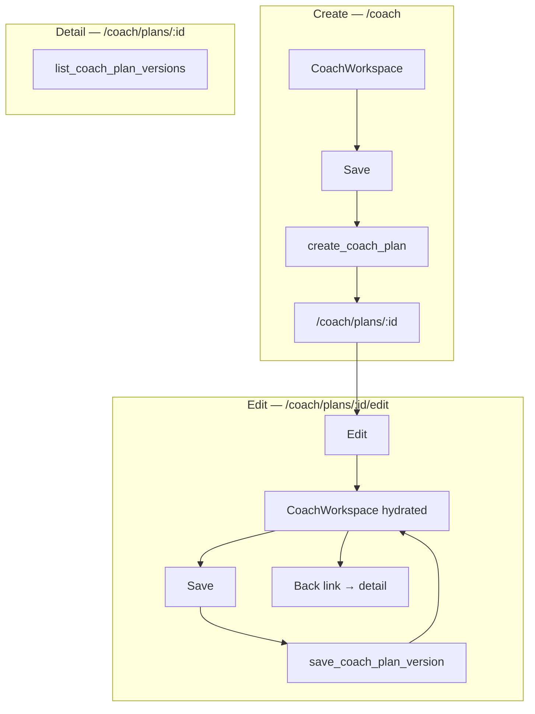

# Plan persistence & linking

Phased implementation for saving plans from the coach workspace, editing existing plans, version history, and navigation.

## Decisions

| Topic | Choice |
| --- | --- |
| Edit route | `/coach/plans/[planId]/edit` |
| Chat on edit | Empty each session; artifact pre-loaded |
| Version history v1 | List only (no restore / preview) |
| `change_summary` | Null on save for now |
| Save trigger | Explicit Save click only |
| After save (create) | Redirect to `/coach/plans/[planId]` |
| After save (edit) | Stay in workspace |
| Unsaved changes | Confirm only when using edit-mode back link |
| Title on save | Toolbar title overwrites `plan_data.name` |
| Atomic create | Supabase RPC |

## Phases

Build in order. Each phase doc tracks scope, files, and done criteria.

1. [phase_1.md](./phase_1.md) — Persistence layer (RPCs, repository, API)
2. [phase_2.md](./phase_2.md) — Save from preview (create mode) + redirect
3. [phase_3.md](./phase_3.md) — Edit route + workspace hydration + back link
4. [phase_4.md](./phase_4.md) — Version history list on plan detail
5. [phase_5.md](./phase_5.md) — New button → coach home
6. [phase_6.md](./phase_6.md) — Workspace state extensions & integration QA

## Architecture

