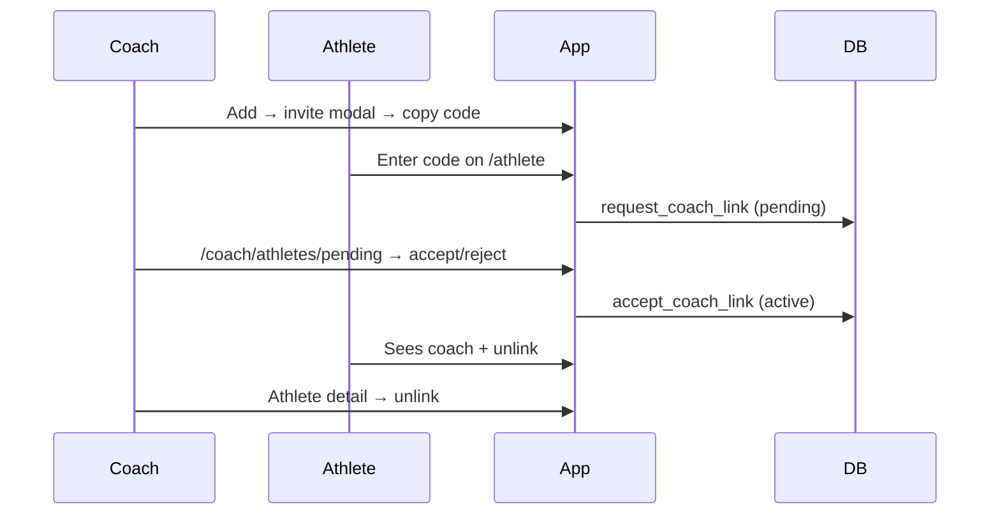

# Linking overview

## Flow

## Data model

- `profiles.invite_code` — coaches only, 8-char unique code
- `coach_athletes.status` — `pending` | `active`
- `coach_athletes.unlinked_at` — set on reject, cancel, or unlink
- One **active** coach per athlete; one **pending** request per athlete at a time

## RPCs (security definer)

| RPC | Caller | Purpose |
| --- | --- | --- |
| `request_coach_link(invite_code)` | athlete | Create pending row |
| `cancel_coach_link_request(relationship_id)` | athlete | Cancel pending |
| `accept_coach_link(relationship_id)` | coach | pending → active |
| `reject_coach_link(relationship_id)` | coach | Dismiss pending |
| `unlink_coach_athlete(relationship_id)` | coach or athlete | End active link |
| `get_athlete_coach_link()` | athlete | Current pending/active relationship |
| `get_coach_pending_invites()` | coach | Pending list |
| `count_coach_pending_invites()` | coach | Badge count |

## UX decisions (locked)

- Coach **Add** opens modal with invite code + copy button
- Athletes list shows red **Pending (N)** pill linking to `/coach/athletes/pending`
- Active athletes stay on main list; pending on separate page
- Athlete `/athlete`: no code input when linked; pending shows wait + cancel; active shows coach + centered unlink
- Coach unlink on `/coach/athletes/[athleteId]`; no settings-page invite display in v1
- Re-request after unlink/cancel is allowed
