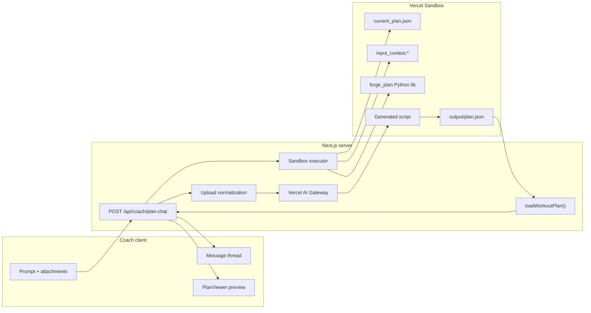

# Plan generation (v1) — overview

Coach-only flow for **creating and iterating a new workout plan in memory** via chat, optional file uploads, Vercel AI Gateway, and Vercel Sandbox (Python). No database writes in v1. Saved-plan edits and real `@` mention routing come later.

## Architecture

## Locked decisions (Phase 0)

| Topic | Decision |
| --- | --- |
| Execution | **Vercel Sandbox** (not E2B) |
| Surface | **Coach only** |
| v1 scope | **New plan create/iterate only** — client sends ephemeral `currentArtifact`; no loading/updating saved plans from DB |
| `@` mentions | **Cosmetic in v1** — do not branch on athlete/plan mentions for routing |
| Sandbox language | **Python** + thin **builder library** aligned to `schemas/workout-plan.schema.json` |
| Local dev | **Real sandbox** connected (no mock runner) |
| LLM routing | **Vercel AI Gateway** |
| Uploads | **Multiple files**; **server-side parse**; compact text context to the model |
| Formats | CSV (as CSV), PDF (Markdown/plain sections), XLSX (sheet → CSV-like text + metadata) |
| XLSX ambiguity | If workbook has multiple sheets and user did not specify, **assistant asks which sheet** before running sandbox |
| Artifact load | On sandbox run, write **`current_plan.json`** from client artifact (empty seed if none) |
| Validation | **Ajv** via existing `loadWorkoutPlan()` — block invalid preview |
| Persistence | **None** in v1 — preview in memory until explicit save (later) |
| Future | Plan traversal/glimpse tools for agents; DB `plan_versions`; intent router; saved-plan edits |

## Upload policy (defaults)

| Rule | Value |
| --- | --- |
| Max files per message | **5** |
| Max total payload | **25 MB** |
| CSV max size | **2 MB** |
| XLSX max size | **5 MB** |
| PDF max size | **10 MB** |
| Allowed extensions | `.csv`, `.xlsx`, `.xls`, `.pdf` |
| XLSX default | First sheet only if user names one sheet in prompt; otherwise clarify when `sheetCount > 1` |

Adjust caps in `lib/uploads/limits.ts` when implemented.

## API contract (target)

**Request** (multipart or JSON + separate upload step TBD in Phase 3):

- `prompt` — serialized prompt document (segments → text)
- `messages` — optional prior turns for thread continuity
- `currentArtifact` — optional `WorkoutPlan` JSON (last valid artifact)
- `files[]` — raw uploads (server normalizes)

**Response** (streaming):

- `assistantText` — stream tokens to chat
- `runStatus` — lifecycle events (see Phase 5)
- `artifact` — full plan JSON **only** when validation passes (separate channel/event, not embedded in markdown)
- `warnings` / `errors` — structured, UI-ready

## v1 “working” definition

- Prompt-only plan generation and iteration updates preview
- Prompt + CSV / PDF / XLSX (Google Sheets exports) works with server normalization
- Invalid artifacts never render in `PlanViewer`
- Chat thread reflects run lifecycle
- No DB save required
- Local `pnpm dev` uses real Vercel Sandbox

## Phase index

| Phase | Doc | Summary |
| --- | --- | --- |
| 1 | [phase-1-foundation.md](./phases/phase-1-foundation.md) | Tooling, env, deps, AGENTS.md |
| 2 | [phase-2-upload-normalization.md](./phases/phase-2-upload-normalization.md) | Server parsers, caps, XLSX sheet rules |
| 3 | [phase-3-chat-api.md](./phases/phase-3-chat-api.md) | Gateway, route, streaming contract |
| 4 | [phase-4-sandbox.md](./phases/phase-4-sandbox.md) | Python builder lib + sandbox executor |
| 5 | [phase-5-client-workspace.md](./phases/phase-5-client-workspace.md) | Chat UI, state, preview pane |
| 6 | [phase-6-integration.md](./phases/phase-6-integration.md) | E2E wiring, tests, QA checklist |

Implement in order. Phases 2–4 can overlap slightly once Phase 1 env is green.

## Code map (target)

| Area | Planned location |
| --- | --- |
| Upload limits & parsers | `forge-next/lib/uploads/` |
| Chat orchestration | `forge-next/lib/ai/plan-chat/` |
| Sandbox runner | `forge-next/lib/sandbox/` |
| Python builder | `forge-next/sandbox/forge_plan/` (bundled into sandbox) |
| Route | `forge-next/app/api/coach/plan-chat/route.ts` |
| Coach workspace | `forge-next/app/coach/(app)/create/` or `/plans/draft/` |
| Chat UI | `forge-next/components/coach/plan-chat/` |

## Out of scope (v1)

- Athlete app chat
- Saving to `plans` / `plan_versions`
- Loading/editing plans by `planId` from Supabase
- Intent classifier (`plan_create` / `plan_edit` / `general_chat`) — labels cosmetic only
- Agent plan traversal tools (glimpse/navigate) — design hook only
- E2B
- Repair loop (validate → auto-fix → re-run) — optional fast-follow after Phase 6
