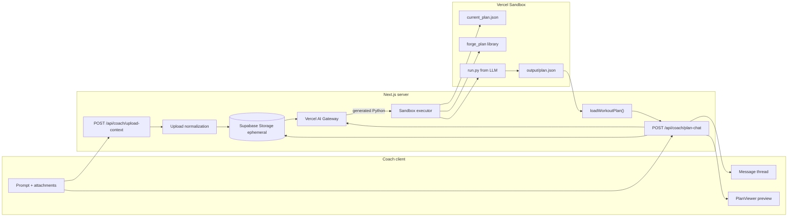

# Plan generation (v1) — overview

Coach-only flow for **creating and iterating a new workout plan in memory** via chat, optional file uploads, Vercel AI Gateway, and Vercel Sandbox (Python). No database writes in v1. Saved-plan edits and real `@` mention routing come later.

## Architecture

**Data boundaries:**

| Data | LLM (Gateway) | Sandbox |
| --- | --- | --- |
| User prompt + thread | Yes | No |
| Normalized upload text (from Storage) | Yes | **No** |
| `summarizePlan()` compact text | Yes (iterations) | No |
| `forge_plan` API cheat sheet (short, from pydoc) | Yes | No (library is in VM) |
| Full `currentArtifact` JSON | **No** | Yes → `current_plan.json` only |
| Generated Python | No (Gateway outputs it) | Yes → `run.py` |

## Locked decisions (Phase 0)

| Topic | Decision |
| --- | --- |
| Execution | **Vercel Sandbox** only — **E2B will not be used** |
| Surface | **Coach only**; workspace is **coach home** (evolve existing `CoachHomePrompt` layout) |
| v1 scope | **New plan create/iterate only** — client sends ephemeral `currentArtifact`; no loading/updating saved plans from DB |
| `@` mentions | **Cosmetic in v1** — do not branch on athlete/plan mentions for routing |
| Sandbox contents | **`current_plan.json` + `forge_plan/` + `run.py` only** — no upload summaries or `input_context` files in the VM |
| Sandbox language | **Python** + thin **builder library** aligned to `schemas/workout-plan.schema.json` |
| Codegen | Gateway produces **Python**; server writes it to sandbox and executes |
| Local dev | **Real sandbox** connected (no mock runner) |
| LLM routing | **Vercel AI Gateway** |
| Uploads | **Multiple files**; **server-side parse**; normalized text to **Supabase Storage**; plan-chat sends **`contextFileIds[]`** not raw file bodies |
| Upload → model | Normalized text loaded server-side into Gateway prompt only |
| Formats | CSV (as CSV), PDF (Markdown/plain sections), XLSX (sheet → CSV-like text + metadata) |
| XLSX ambiguity | If workbook has multiple sheets and user did not specify, **assistant asks which sheet** before running sandbox |
| Artifact seed | Server writes **`current_plan.json`** in sandbox from client `currentArtifact` (empty seed if none) — **never** sent as full JSON to the LLM |
| Plan context for LLM | **`summarizePlan(artifact)`** — short text summary for iterations (not full artifact, not traversal tools) |
| Validation | **Ajv** via existing `loadWorkoutPlan()` — block invalid preview |
| Persistence | **None** in v1 — preview in memory until explicit save (later) |
| Future | Plan traversal/glimpse tools for agents; DB `plan_versions`; intent router; saved-plan edits |

## Upload policy (defaults)

| Rule | Value |
| --- | --- |
| Max files per message | **5** |
| Max total payload | **25 MB** |
| CSV max size | **2 MB** |
| XLSX max size | **5 MB** |
| PDF max size | **10 MB** |
| Allowed extensions | `.csv`, `.xlsx`, `.xls`, `.pdf` |
| XLSX default | First sheet only if user names one sheet in prompt; otherwise clarify when `sheetCount > 1` |

Adjust caps in `lib/uploads/limits.ts` when implemented.

## API contract (target)

### Upload context (Phase 2–3)

`POST /api/coach/upload-context` — multipart `files[]`:

- Normalize server-side → write text to Supabase Storage (`draft-uploads/{coachId}/{draftId}/…`)
- Return `{ contextFileIds: string[], warnings?: … }`

### Plan chat

`POST /api/coach/plan-chat` — JSON body:

- `prompt` — serialized prompt document (segments → text)
- `messages` — optional prior turns for thread continuity
- `currentArtifact` — optional `WorkoutPlan` JSON — **server-only** (sandbox seed), not passed to LLM
- `contextFileIds` — optional ids from upload step (server loads normalized text for Gateway)

### Response

**Stream (tokens only):**

- `assistantTextDelta` — conversational reply

**Non-streamed events** (discrete SSE / data packets):

- `runStatus` — `parsing` | `generating` | `sandbox` | `validating` | `done` | `error`
- `artifact` — full plan JSON only when validation passes
- `warnings` — non-fatal (truncated CSV, page caps, etc.)
- `errors` — fatal / actionable (parse failure, sandbox timeout, validation paths, missing output)

Preview and run status may update before assistant text finishes streaming.

## v1 “working” definition

- Prompt-only plan generation and iteration updates preview
- Prompt + CSV / PDF / XLSX (Google Sheets exports) works with server normalization
- Invalid artifacts never render in `PlanViewer`
- Chat thread reflects run lifecycle
- No DB save required (no `plan_versions`; ephemeral Storage OK)
- Local `pnpm dev` uses real Vercel Sandbox
- Upload content never written into sandbox filesystem

## Phase index

| Phase | Doc | Summary | Status |
| --- | --- | --- | --- |
| 1 | [phase-1-foundation.md](./phases/phase-1-foundation.md) | Tooling, env, deps, AGENTS.md | **Done** |
| 2 | [phase-2-upload-normalization.md](./phases/phase-2-upload-normalization.md) | Server parsers, Storage, caps, XLSX sheet rules | |
| 3 | [phase-3-chat-api.md](./phases/phase-3-chat-api.md) | Gateway, route, streaming contract | |
| 4 | [phase-4-sandbox.md](./phases/phase-4-sandbox.md) | Python builder lib + sandbox executor | |
| 5 | [phase-5-client-workspace.md](./phases/phase-5-client-workspace.md) | Coach home UI, state, preview pane | |
| 6 | [phase-6-integration.md](./phases/phase-6-integration.md) | E2E wiring, tests, QA checklist | |

Implement in order. Phases 2–4 can overlap slightly once Phase 1 env is green.

## Code map (target)

| Area | Planned location |
| --- | --- |
| Upload limits & parsers | `forge-next/lib/uploads/` |
| Chat orchestration | `forge-next/lib/ai/plan-chat/` |
| Sandbox runner | `forge-next/lib/sandbox/` |
| Python builder | `forge-next/sandbox/forge_plan/` (bundled into sandbox) |
| Cheat sheet generator | `forge-next/sandbox/forge_plan/scripts/generate_api_cheat_sheet.ts` (or `.py` invoker) |
| Upload route | `forge-next/app/api/coach/upload-context/route.ts` |
| Plan chat route | `forge-next/app/api/coach/plan-chat/route.ts` |
| Coach workspace | `forge-next/app/coach/(app)/page.tsx` + `CoachHomePrompt` (split pane) |
| Chat UI | `forge-next/components/coach/plan-chat/` |
| Shared primitives | `forge-next/components/ui/` |

## Out of scope (v1)

- Athlete app chat
- Saving to `plans` / `plan_versions`
- Loading/editing plans by `planId` from Supabase
- Intent classifier (`plan_create` / `plan_edit` / `general_chat`) — labels cosmetic only
- Agent plan traversal / glimpse tools (v1 uses `summarizePlan` only)
- Upload files or summaries inside the sandbox VM
- Repair loop (validate → auto-fix → re-run) — optional fast-follow after Phase 6
